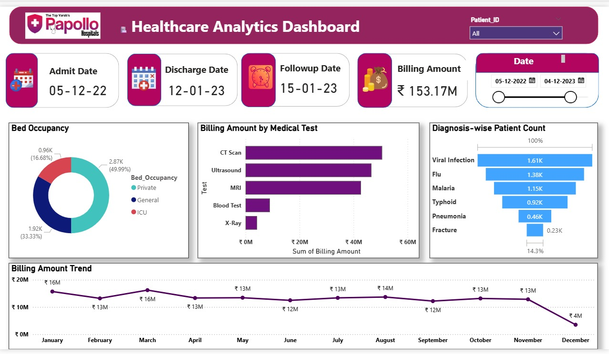

# 🏥 Healthcare Analytics Dashboard | Power BI

An interactive **Healthcare Analytics Dashboard** built using **Microsoft Power BI** to analyze hospital data and generate meaningful business insights. The dashboard provides a clear overview of patient information, billing trends, diagnosis distribution, and bed occupancy through interactive visualizations.

---

## 📌 Project Overview

This project demonstrates how raw healthcare data can be transformed into an interactive dashboard for better decision-making. The dashboard helps users monitor hospital performance, identify billing trends, and analyze patient-related information using dynamic charts and filters.

---

## 🎯 Objectives

- Analyze hospital billing data.
- Track patient admissions and discharges.
- Monitor monthly billing trends.
- Visualize diagnosis-wise patient count.
- Analyze bed occupancy.
- Build an interactive dashboard using Power BI.

---

## 📊 Dashboard Features

### 🔹 KPI Cards
- 📅 Admit Date
- 📅 Discharge Date
- 📅 Follow-up Date
- 💰 Total Billing Amount

### 🔹 Interactive Visualizations
- 🛏️ Bed Occupancy (Donut Chart)
- 💰 Billing Amount by Medical Test (Bar Chart)
- 🩺 Diagnosis-wise Patient Count (Funnel Chart)
- 📈 Monthly Billing Amount Trend (Line Chart)

### 🔹 Interactive Filters
- Patient ID
- Date Range

---

## 🛠️ Tools & Technologies

- Microsoft Power BI
- Power Query
- DAX
- Data Modeling
- Data Cleaning
- Data Visualization
- Microsoft Excel

---

## 📈 Key Insights

- CT Scan generated the highest billing amount.
- Viral Infection recorded the highest patient count.
- Billing amount varied across different months.
- Bed occupancy distribution can be monitored by ward type.
- Interactive slicers enable dynamic data exploration.

---

## 📷 Dashboard Preview



---

## 📂 Project Structure

```text
Healthcare-Analytics-Dashboard/
│
├── Images/
│   └── dashboard.png
│
├── healthcare_analytics_dashboard.pbix
│
├── Papollo_Healthcare_Dataset.xlsx
│
└── README.md
```

---

## 💡 Skills Demonstrated

- Power BI Dashboard Development
- Data Cleaning & Transformation
- KPI Design
- Interactive Dashboard Design
- Business Intelligence
- Data Visualization
- Data Analysis
- Data Storytelling

---

## 🚀 Future Enhancements

- Doctor Performance Analysis
- Patient Demographics Dashboard
- Department-wise Analytics
- Advanced DAX Measures
- Drill-through Reports

---

## 👩‍💻 Author

**Anushka Pawar**

- 🎓 Bachelor of Computer Applications (BCA)
- 💼 Aspiring Data Analyst
- 📊 Passionate about Power BI, SQL, Python, and Data Analytics


---

## ⭐ Support

If you found this project useful, please consider giving this repository a ⭐ on GitHub.