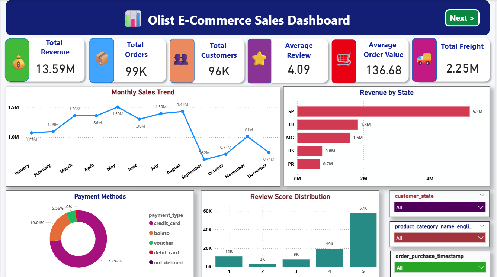
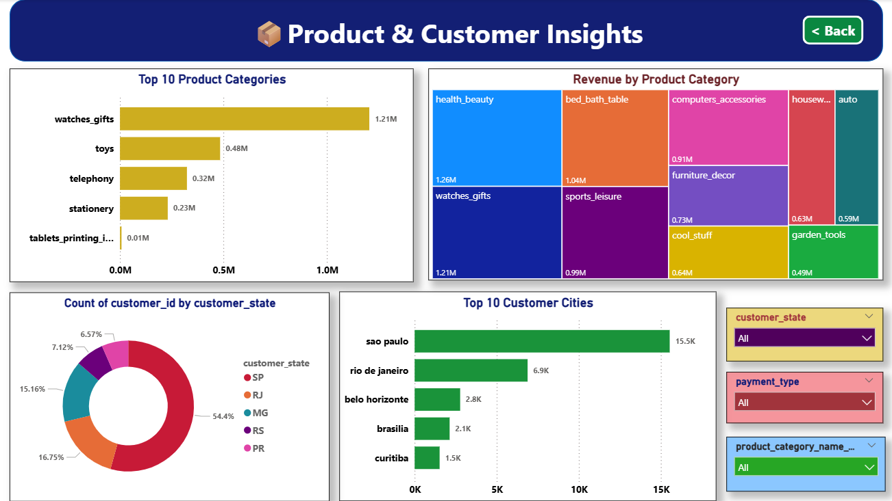

# 🛒 Olist E-Commerce Analysis | SQL + Python + Power BI

An end-to-end Data Analytics project built using the **Brazilian Olist E-Commerce Dataset**. This project demonstrates the complete analytics workflow, including data import, SQL analysis, Python EDA, and an interactive Power BI dashboard.

---

## 📌 Project Overview

This project covers the complete Data Analytics lifecycle:

- Data Import into MySQL
- SQL Data Analysis
- Data Cleaning using Python
- Exploratory Data Analysis (EDA)
- Business Insights
- Interactive Power BI Dashboard

---

## 🛠 Tech Stack

- **Python**
- **Pandas**
- **MySQL**
- **SQLAlchemy**
- **PyMySQL**
- **SQL**
- **Power BI**
- **VS Code**

---

# 📂 Project Structure

```
06_OLIST E-COMMERCE ANALYSIS
│
├── Dashboard_Images
│   ├── dashboard_page1.png
│   └── dashboard_page2.png
│
├── Data
│   ├── olist_customers_dataset.csv
│   ├── olist_geolocation_dataset.csv
│   ├── olist_order_items_dataset.csv
│   ├── olist_order_payments_dataset.csv
│   ├── olist_order_reviews_dataset.csv
│   ├── olist_orders_dataset.csv
│   ├── olist_products_dataset.csv
│   ├── olist_sellers_dataset.csv
│   └── product_category_name_translation.csv
│
├── Output
│   ├── clean_orders.csv
│   ├── monthly_orders.csv
│   ├── state_revenue.csv
│   ├── top_categories.csv
│   └── weekday_orders.csv
│
├── Power_BI
│   └── Olist_Ecommerce_Dashboard.pbix
│
├── Python
│   ├── 01_import_all_tables.py
│   ├── 02_import_customers.py
│   ├── 03_dataExploPD.py
│   ├── 04_datacleaning.py
│   ├── 05_EDA.py
│   └── 06_multiTableEDA.py
│
├── sql
│   ├── basicquery.sql
│   └── joins.sql
│
└── README.md
```

---

# 📊 Dataset

**Dataset:** Olist Brazilian E-Commerce Dataset

The dataset contains information about:

- Customers
- Orders
- Products
- Sellers
- Payments
- Reviews
- Order Items
- Product Categories
- Geolocation

---

# ⚙ Project Workflow

## 1️⃣ Data Import

- Imported all CSV files into MySQL
- Automated import using Python
- Used SQLAlchemy and Pandas

Python Script:

```
01_import_all_tables.py
```

---

## 2️⃣ SQL Analysis

Performed SQL operations such as:

- SELECT
- WHERE
- GROUP BY
- ORDER BY
- Aggregate Functions
- INNER JOIN
- LEFT JOIN

SQL Files:

```
basicquery.sql

joins.sql
```

---

## 3️⃣ Data Cleaning (Python)

Performed:

- Date Conversion
- Missing Value Analysis
- Duplicate Check
- Column Renaming
- Feature Engineering

Created new columns:

- Purchase Year
- Purchase Month
- Purchase Day
- Weekday
- Delivery Days

---

## 4️⃣ Exploratory Data Analysis

Performed analysis such as:

- Monthly Orders
- Order Status Distribution
- Delivery Time Analysis
- Weekday Analysis
- Revenue Trends

Generated cleaned datasets inside the **Output** folder.

---

## 5️⃣ Multi-Table Analysis

Used Pandas Merge (SQL JOIN equivalent)

Business Insights:

- Revenue by State
- Top Product Categories
- Payment Method Analysis
- Review Score Distribution
- Top Customer Cities

---

# 📈 Power BI Dashboard

The project includes a two-page interactive dashboard.

## Dashboard Features

### Page 1 – Sales Overview

- Total Revenue
- Total Orders
- Total Customers
- Average Review
- Average Order Value
- Total Freight
- Monthly Sales Trend
- Revenue by State
- Payment Methods
- Review Score Distribution

Interactive Filters:

- State
- Product Category
- Purchase Date

---

### Page 2 – Product & Customer Insights

- Top Product Categories
- Revenue by Product Category
- Customer Distribution by State
- Top Customer Cities

Interactive Filters:

- State
- Product Category
- Payment Type

---

# 📷 Dashboard Preview

## Dashboard Page 1



---

## Dashboard Page 2



---

# 📊 Key Business Insights

- São Paulo generated the highest revenue.
- Credit Card is the most preferred payment method.
- Health & Beauty is among the highest revenue-generating categories.
- Most customers give 5-star reviews.
- Monthly sales peaked during the middle of the year.

---

# 🚀 Skills Demonstrated

- SQL
- MySQL
- Python
- Pandas
- SQLAlchemy
- Data Cleaning
- Feature Engineering
- Exploratory Data Analysis
- Data Visualization
- Business Analysis
- Power BI Dashboard Development

---

# ▶ How to Run

### Clone Repository

```bash
git clone https://github.com/your-username/06_OLIST-E-COMMERCE-ANALYSIS.git
```

### Install Required Libraries

```bash
pip install pandas sqlalchemy pymysql matplotlib
```

### Import Data

Run:

```bash
python Python/01_import_all_tables.py
```

### Open Dashboard

Open:

```
Power_BI/Olist_Ecommerce_Dashboard.pbix
```

---

# 👩‍💻 Author

**Anushka Pawar**

Aspiring Data Analyst

- SQL
- Python
- Power BI
- Data Analytics